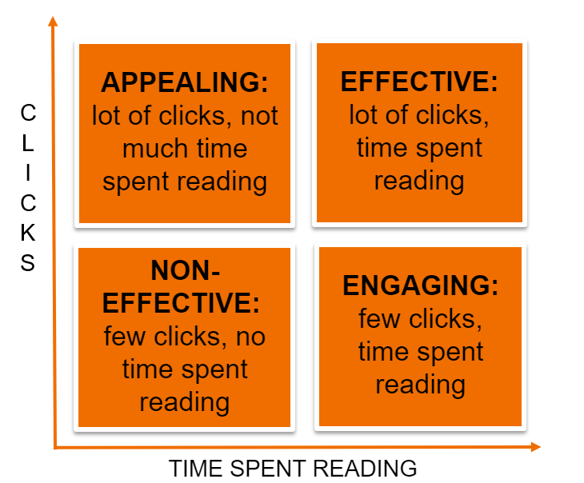

# Scripts for training Otsikkokone

## What is Otsikkokone?
Otsikkokone is finnish and the english translation is "headline machine". Otsikkokone tries to estimate the impact of a news headline before the the news article is published. This enables 
the author to experiment with different headlines before actually publishing the article. The impact of the headline is measured with the number of clicks (visits) to the article and time spent 
on reading it. Impact was divided into four classes that are shown in the figure below. These classes act as outputs for the model. File example_input_data.json shows an example of the input data for the model.



## Install dependencies
The instructions were tested with (X)Ubuntu 18.04 LTS. Other distributions may or may not work.

First make sure that the system is up to date:

sudo apt-get update
sudo apt-get dist-upgrade

Have at least python version 3.6.9:

python3 --version
Python 3.6.9

sudo apt install python3-venv

python3 -m venv Otsikkokone_env
source Otsikkokone_env/bin/activate
pip install --upgrade pip
pip install --upgrade setuptools

Install the required libraries with "pip install -r requirements.txt". (or pip install -r requirements_cpu_only.txt if you do not have a GPU)

Current version uses [FinBERT](https://github.com/TurkuNLP/FinBERT), get it with

```terminal
wget http://dl.turkunlp.org/finbert/bert-base-finnish-uncased-v1.zip
unzip bert-base-finnish-uncased-v1.zip
rm bert-base-finnish-uncased-v1.zip
```

## Usage
Usage example to train the model; use UNCASED version of FinBert:

`python otsikkokone.py --neurons 512 --bert_data_path bert-base-finnish-uncased-v1 --features_file example_input_data.pickle --epochs 100`


Example training log end:

Epoch 98/100
6/6 [==============================] - 2s 379ms/step - loss: 1.1526 - acc: 0.6667 - val_loss: 1.5880 - val_acc: 0.0000e+00
Epoch 99/100
6/6 [==============================] - 2s 383ms/step - loss: 1.0449 - acc: 0.6667 - val_loss: 1.5880 - val_acc: 0.0000e+00
Epoch 100/100
6/6 [==============================] - 2s 371ms/step - loss: 1.0639 - acc: 0.6667 - val_loss: 1.5880 - val_acc: 0.0000e+00
Evaluating performance on validation and test data
1/1 [==============================] - 1s 507ms/step
[[0 0]
 [1 0]]
saving results Namespace(bert_data_path='bert-base-finnish-uncased-v1', calculate_response=False, epochs='100', features_file='example_input_data.pickle', hidden_layers=1, model_filename='model.h5', neurons='512', no_premium=False, prem_free_separate=False, use_lemmatized_title=False, use_sections=False, use_temporal_features=False, use_title_features=False);1.063857913017273;0.6666666865348816;1.58795964717865;0.0;[[0, 0], [1, 0]];1.6743741035461426;0.0;[[0, 0], [1, 0]]

Total time elapsed [seconds]: 296.36264872550964


Now you should have a file: model.h5 in the current directory that contains the trained model. The model can be loaded and used for inference (same preprocessing steps are needed before the inference as in the model training).


Parameters:

  --neurons NEURONS     Number of neurons per layer.

  --bert_data_path BERT_DATA_PATH
                        Path containing BERT data files.

  --features_file FEATURES_FILE
                        Path for the input data (pickle), similar as
                        exampledata.pickle

  --use_sections [USE_SECTIONS [USE_SECTIONS ...]]
                        Use news article sections as additional input for the
                        model.

  --epochs EPOCHS       Number of training epochs

  --use_lemmatized_title
                        Use titles in lemmatized format.

  --use_temporal_features
                        Use publishing time as a feature

  --use_title_features {binary,cont}

  --hidden_layers HIDDEN_LAYERS
                        Number of custom hidden layers.

  --calculate_response  Defines whether to calculate response variable or use
                        the precalculated one on the input data.

  --no_premium          Ignore content behind a paywall.

  --prem_free_separate  Calculate response variable separately for free and
                        premium content.

  --model_filename      Filename where to save the trained model.


## Tips
The flag `--use_sections` controls section inclusion/exclusion. Your options are
- If you don't want to use sections at all, do not use the flag
- If you want to use all the available sections, use the flag (with no arguments)
- If you want top X most usual sections, use the flag as `--use_sections X` where X is your desired number of sections
- If you want to use certain sections, specify them after the flag, e.g. `--use_sections Kotimaa Ulkomaat` would only use articles whose sections is Kotimaa or Ulkomaat

Add flag `--use_lemmatized_title` to use lemmatized titles instead of raw text titles, and flag `--use_temporal_features` to include temporal features.

The flag `--use_title_features` controls the usage of manually extracted headline features. With `cont`, the software looks for field `title_features` in your data. This should
contain features that are either continuous or binary. If you'd rather use classified headline features, use the argument `binary`. The software will look for field 
`title_features_binarised` in your data. If this option is used, all the variables with more than two unique values will be one-hot-encoded. The field `title_features_binarised` 
is not included in the example data.

Use the flag `--calculate_response` to calculate the response for the articles (or use the precalculated responses).

Flags `--no_premium` and `--prem_free_separate` control the handling of premium articles. If `--no_premium` is used, only the free articles are considered. 
If `--prem_free_separate` is used, the median values for the metric is calculated separately for premium and free articles.


Recommendations from the tests so far:
- Use 128 or 256 neurons (or something in between). 512 and 1024 work only slightly better than 256. 
- Using sections improves accuracy. Using all of them seems most preferable. Sectionwise models are poor. The effect of section, however, is very significant, so consider how much you want the section to influence your model. No sections may be preferred.
- Non-lemmatized title works better than lemmatized
- Temporal features do not bring much, the trigonometric transformation probably better than one-hot-encode

## Acknowledgements
Code snippets from https://www.kaggle.com/gauravs90/keras-bert-toxic-model-bert-fine-tuning-with-keras where used as an initial template when developing Otsikkokone.

